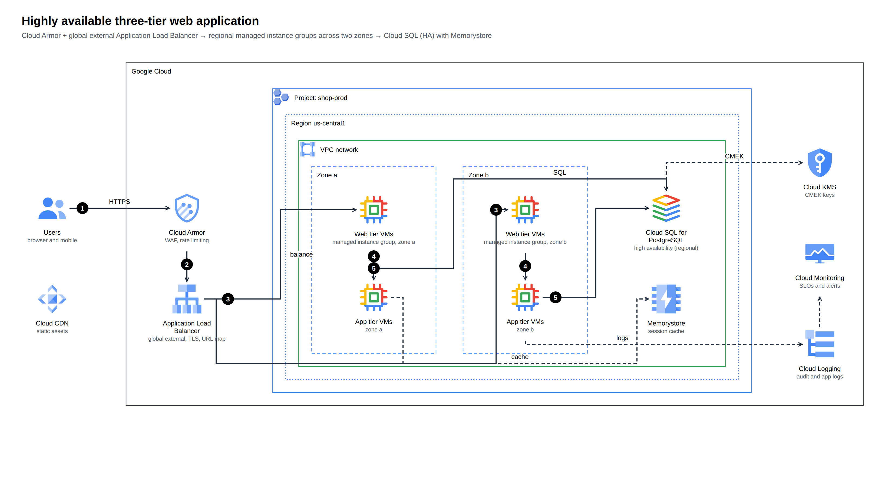
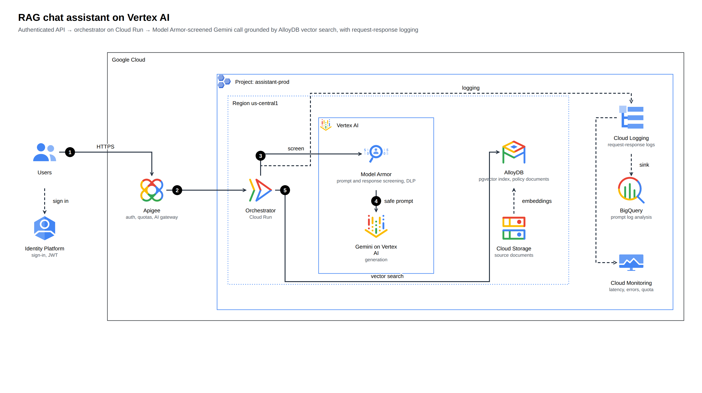

# archify-gcp

Generate **Google Cloud architecture diagrams** from a typed JSON spec — using the **official Google Cloud icons**, Google Cloud Architecture Center-style groups,
and an advisory **Google Cloud Well-Architected Framework** review, with an optional **monthly cost estimate** from the Cloud Billing Catalog API.
A companion to [tt-a1i/archify](https://github.com/tt-a1i/archify) and the Google Cloud sibling of [archify-aws](https://github.com/akashtalole/archify-aws) and
[archify-azure](https://github.com/akashtalole/archify-azure): describe the system, get a standalone, explorable HTML (plus SVG/PNG/draw.io) and a receipt of what was checked.

| Three-tier across two zones | RAG assistant on Vertex AI |
|---|---|
|  |  |

Enterprise product catalog search: [architecture](examples/out/product-catalog-search.png) · [page](examples/out/product-catalog-search.html) · [draw.io](examples/out/product-catalog-search.drawio)
Serverless API: [architecture](examples/out/serverless-api.png) · Agent tool call: [sequence](examples/out/agent-tool-call.sequence.png) · Clinical notes: [dataflow](examples/out/clinical-notes.dataflow.png)

Multi-agent ADK on Cloud Run: [architecture](examples/multi-agent-adk-cloud-run/out/architecture.png) · [sequence](examples/multi-agent-adk-cloud-run/out/order-question.sequence.png) · [dataflow](examples/multi-agent-adk-cloud-run/out/agent-delivery.dataflow.png) ([details](examples/multi-agent-adk-cloud-run/README.md))

Multi-cloud AI platform (AWS + Azure + Google Cloud icons): [architecture](examples/multi-cloud-ai-platform/out/architecture.png) ([details](examples/multi-cloud-ai-platform/README.md))

## Install as an agent skill
```bash
npx skills add akashtalole/archify-gcp
```
Installs the skill into your agent (Claude Code, Cursor, Codex and others; the CLI asks which). The official icons are downloaded automatically the first time you render (network needed once; set `ARCHIFY_NO_AUTOFETCH=1` to disable). The sibling skills install the same way: `akashtalole/archify-aws`, `akashtalole/archify-azure`, `akashtalole/archify-gcp`.

## Quick start (from a clone)
```bash
git clone https://github.com/akashtalole/archify-gcp && cd archify-gcp
npm run icons:fetch                                  # official icons → assets/gcp-icons/ (git-ignored)
node bin/archify-gcp.mjs render examples/genai-rag.json --png --drawio
open examples/out/genai-rag.html           # tabs: Diagram · Well-Architected review (· Cost when a price book exists)
open "examples/out/genai-rag.html?tab=wa"
```
Node ≥ 20, **no npm dependencies**. PNG export needs Chrome/Chromium (`CHROME_PATH` or a Playwright browser).

### Cost estimates need your own API key
The Cloud Billing Catalog API requires an API key (enable the *Cloud Billing API* on a project and create a key):
```bash
GOOGLE_API_KEY=… npm run prices:fetch        # builds data/prices/us-central1.json (on-demand list prices)
node bin/archify-gcp.mjs cost examples/three-tier.json
```
Without a price book the Cost tab is omitted and everything else works. The SKU patterns behind the pricers were written without access to a live catalog:
the first `prices:fetch` shows which services need a pattern adjustment (a non-matching pricer reports `needs-input`, never a wrong number).

### Use it from an AI agent
`SKILL.md` is an agent skill (same shape as Archify's). Point your agent at this repo and say, e.g.:
*"Use archify-gcp to diagram a multi-zone GKE app behind Cloud Load Balancing with Cloud SQL, and review it against the Well-Architected pillars."*

## What you get
* **Official icons** — 223 Google Cloud product icons (the current-brand core set replaces the legacy icon where Google publishes one), the 26 product **category** icons (Compute, Agents, Observability… as `category-*`) and 10 original general icons; `icons search`, aliases (`gke`, `bq`, `gcs`, `kms`, `iap`, `vertex-ai`…).
* **Google Cloud groups** — Google Cloud, organization, folder, project, region, zone, VPC network, subnet, VPC Service Controls perimeter, firewall rules, on-premises, custom product groups; numbered callouts (hover for the description); light and dark themes.
* **Layout + routing** — nest groups, list children; rows align icon centre lines; the router avoids nodes and group headers, prefers straight lines, and warns (exit code 2 with `--strict`) when it can't find a clean route.
* **Three diagram types** — `architecture`, `sequence` (lifelines, boundaries, fragments), `dataflow` (stage columns).
* **Well-Architected review tab** — the Google Cloud Well-Architected Framework: 6 pillars, 37 principles, 174 recommendations; five statuses, impact × likelihood risk, Eisenhower plan, SMART goals, AI-workload findings. Advisory: it reads the *drawing*, not your configuration.
* **Cost tab (with a price book)** — Compute Engine, GKE, Cloud Run, Cloud Run functions, Cloud Storage, BigQuery, Pub/Sub, Cloud SQL, Cloud Logging pricers; assumptions, sensitivity and what-ifs. All arithmetic is code.
* **draw.io export** — a `.drawio` file with the official icons embedded as images (as draw.io's own `gcp2` library does) and styled group containers; fully editable.
* **`finalize`** — validate → render → strict checks → real-browser check → PNG → deterministic `*.receipt.json`. Never claims visual quality: it records `visualReview: "not-performed"`.
* **Viewer runtime** — Passport, Reach, Route probe, Finder (`/`), presentation (`p`), deep links (`#focus=orch&reach=downstream`, `#route=a~b`), export to PNG/JPEG/WebP/SVG/draw.io. See [references/viewer-runtime.md](references/viewer-runtime.md).
* **Import** — `import mermaid` (flowchart + sequenceDiagram → Google Cloud icons, with mapping confidence) and `import iac` (Terraform `google` provider → architecture; resolves Pub/Sub subscriptions, IAM bindings, URL maps…). See [references/importers.md](references/importers.md).
* **Schemas + routing** — `schema` (JSON Schemas for editors/agents), `guide "<scenario>"` (which type and template).

## Commands
```text
archify-gcp finalize <spec.json> [--json]      archify-gcp render <spec.json> [-o out.html] [--svg] [--png] [--drawio] [--theme dark] [--no-review] [--no-cost] [--strict] [--json]
archify-gcp validate <spec.json>              archify-gcp review <spec.json>            archify-gcp export <spec.json> --format drawio
archify-gcp cost <spec.json> [--scale 1,3,10]  archify-gcp wa review|corpus
archify-gcp import mermaid <file|-> | import iac <dir>       archify-gcp guide "<scenario>"      archify-gcp schema <type>
archify-gcp icons search|info|categories|groups
archify-gcp init three-tier|serverless-api|genai-rag|sequence|dataflow      archify-gcp fetch-icons | doctor
```
Spec format: [references/spec.md](references/spec.md) · conventions: [references/gcp-diagram-guidelines.md](references/gcp-diagram-guidelines.md) · review rules: [references/well-architected.md](references/well-architected.md) · cost: [references/cost-estimation.md](references/cost-estimation.md).

```json
{ "meta": { "title": "Hello Google Cloud" },
  "root": { "layout": "row", "children": [
    { "id": "u", "icon": "users", "label": "Users" },
    { "id": "cloud", "kind": "gcp-cloud", "children": [
      { "id": "run", "icon": "cloud-run", "label": "Cloud Run" },
      { "id": "db", "icon": "firestore", "label": "Firestore" } ] } ] },
  "edges": [ { "from": "u", "to": "run", "step": 1, "label": "HTTPS" }, { "from": "run", "to": "db", "step": 2 } ] }
```

## Documentation
User guide and developer guide (MkDocs): <https://akashtalole.github.io/archify-gcp/> — source in [`docs/`](docs/); build locally with
`pip install -r requirements-docs.txt && node scripts/stage-docs.mjs && mkdocs serve`.

## Notes and limits
* **Icons are not committed.** Google distributes them under its own terms; `icons:fetch` pulls them from Google. Rendered diagrams embed the icons they use. See [THIRD_PARTY_NOTICES.md](THIRD_PARTY_NOTICES.md).
* Google's icon set has no separate icon for some newer products (Gemini, Model Armor, Vertex AI Search…): the closest official icon is used and the product name goes in the label. Agent products (Agent Engine, Agent Builder, Gemini Enterprise) use the official **Agents** category icon (`category-agents`).
* Google publishes no group-style deck: group colours and corner icons are a house style that follows Architecture Center conventions.
* The Well-Architected ids (`REL-3.1`…) are derived from the page order of Google's framework (which has no official numbering); the snapshot is frozen and `wa corpus --refresh` re-derives it.
* Not a drop-in for Archify's pipeline: this is an independent Google Cloud renderer. `finalize` is the equivalent gate here.
* The router is heuristic. Complex diagrams may need `children` reordering; the warnings say where.
* `npm test` runs the unit and example-render tests (needs the icons fetched).

MIT licensed.
