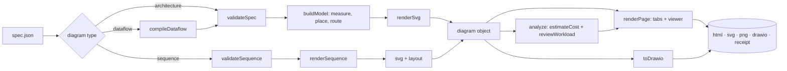

# Architecture



## `buildDiagram(spec)` — the single entry point

`src/pipeline.mjs` returns one object for every diagram type:

| Field | Meaning |
|---|---|
| `type` | `architecture`, `sequence` or `dataflow` |
| `spec` | The spec as validated. For a dataflow it is the **compiled architecture spec**. |
| `warnings`, `stats`, `size` | Layout warnings, counts, canvas size |
| `svg(theme)` | Renders the standalone SVG (light or dark) |
| `steps` | Numbered edges with from/to labels, `desc` and `label` — the **Flow** list and callout text |
| `review()` | Original heuristic findings (input to the Well-Architected engine) |
| `nodeList`, `groupList`, `edgeList` | Normalised lists used by cost, review and exporters |
| `model` | Architecture/dataflow layout model (positions, routes). **Sequence** diagrams expose `layout` instead. |

Everything downstream (cost, review, page, draw.io, finalize) consumes this object, so a new output format only needs to read it.

!!! note "Side effect worth knowing"
    `svg()` populates `model.routes[i].badgePos` and `labelPos`. Exporters that need callout and label positions (draw.io) call `svg("light")` first.

## Diagram types

* **Architecture** — `spec.mjs` validates; `build.mjs` runs `layout.mjs` (measure + place) then `route.mjs` for each edge; `render.mjs` draws.
* **Dataflow** — `dataflow.mjs` compiles stages into columns of an architecture spec (with an optional Google Cloud boundary), then follows the architecture path.
* **Sequence** — `sequence.mjs` validates and renders in one pass (rows, lifelines, fragments, badges) and returns `{ svg, width, height, steps, layout, model, reviewSpec }`.

## Analysis

`analysis.mjs` exposes `analyze(diagram, options)` which returns `{ cost, wa }`:

1. `estimateCost(diagram)` — see [Cost engine](cost-engine.md).
2. `reviewWorkload(diagram, { cost })` — the review reads the estimate for cost-related evidence and trade-offs. See [Well-Architected engine](wa-engine.md).

Both are pure functions of the diagram and the committed data, and accept `asOf`/`now` for reproducible tests.

## The page

`page.mjs` assembles one standalone HTML string: header, tabs, the SVG, the Flow list, `costTab()` and `waTab()` from `report.mjs`, the embedded viewer (`viewer.mjs`: CSS and JS as strings), and the draw.io XML in `<script type="application/json" id="drawio-data">` for the Export menu. The page makes **no network requests**; `finalize` greps for that.

## Data flow of numbers

```text
node.usage ──► pricer (per service) ──► lines {qty × rate = usd, sku, usagetype}
                      ▲ rates from data/prices/<region>.json (never hard-coded)
lines ──► node total ──► category totals, sensitivity (rerun at ×1/×3/×10), what-ifs
```

There is exactly one place where money is computed: `src/cost/`. The report only formats.

## Conventions

* ES modules, no transpilation, no classes except where state is genuinely needed (`Doc` in the draw.io exporter).
* Functions that touch the network live in `scripts/` or behind an explicit `--refresh`.
* Strings that reach HTML go through `esc()` (`render.mjs`); XML through `attr()`/`html()` in the draw.io exporter.
* Comments explain *why* (constraints, Google Cloud rules, gotchas), not what.
