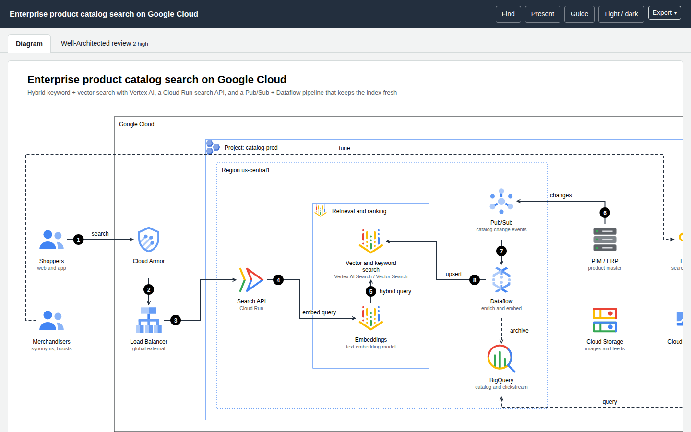

# archify-gcp

**Describe a Google Cloud system in JSON; get a checked, explorable architecture diagram** — drawn with the official Google Cloud icons — together with a monthly cost estimate, a Well-Architected review and an editable draw.io file.

It is the Google Cloud sibling of [archify-aws](https://github.com/akashtalole/archify-aws) and [archify-azure](https://github.com/akashtalole/archify-azure), and a companion to [tt-a1i/archify](https://github.com/tt-a1i/archify): the same ideas (typed spec in, verified artifact and receipt out, agent skill), implemented as an independent, Google Cloud-specific renderer with **no npm dependencies**. It is the Azure sibling of [archify-aws](https://github.com/akashtalole/archify-aws).

## What you get from one spec

| Output | What it is |
|---|---|
| **Interactive HTML page** | Diagram and **Well-Architected review** tab (plus a **Cost** tab when a price book exists) in one standalone file. Click, search, trace routes, hover numbered callouts, switch theme, export. |
| **SVG and PNG** | The diagram on its own, light or dark. |
| **draw.io file** | Official icons embedded as images, styled group containers and connectors — fully editable. |
| **Receipt** | A deterministic JSON record of every check that ran (and an honest note that nobody has *looked* at the picture yet). |

## Where to start

- **[Getting started](user-guide/getting-started.md)** — install, render your first diagram in five minutes.
- **[User guide](user-guide/index.md)** — spec reference, cost estimate, Well-Architected review, draw.io export, importers, CLI.
- **[Examples](user-guide/examples.md)** — live pages you can open: three-tier, serverless API, RAG on Vertex AI, product catalog search, sequence and dataflow.
- **[Developer guide](developer-guide/index.md)** — how the pipeline, router, cost engine, review engine and exporters work, and how to extend them.

## Principles

* **Typed input, checked output.** Unknown icons, dangling edges and unroutable connectors are errors with suggestions, not silent drawings.
* **Honest numbers.** Cost comes from the public Cloud Billing Catalog API with every assumption shown; anything that cannot be priced says so. Well-Architected statuses are *Cannot Determine* unless the diagram is real evidence.
* **Deterministic.** Same spec, same bytes. All arithmetic is code, never model reasoning.
* **Official look.** Icons are never altered; groups, labels and arrows follow the Google Cloud Architecture Center conventions.

!!! note "Icons are not in the repository"
    The Google Cloud icons are © Google LLC and are downloaded on demand with `npm run icons:fetch`. See [Getting started](user-guide/getting-started.md).
