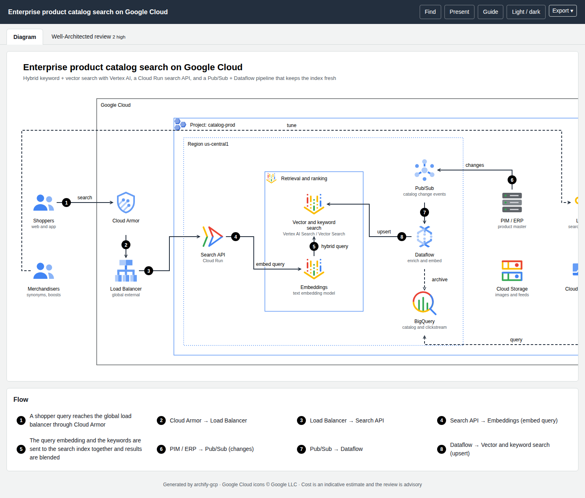

# Examples

Each example is a spec in the repository's `examples/` folder, rendered to a live page you can open (diagram and review tabs, plus a Cost tab when a price book exists, and a draw.io download). Specs carry **illustrative** usage; the cost note on each page says what was assumed. They are demonstrations, not quotes.

## Architecture

| Example | What it shows | Page | draw.io |
|---|---|---|---|
| Three-tier web app | Two zones, Cloud Armor, global Application Load Balancer, managed instance groups, Cloud SQL HA, Memorystore, KMS | [open](../live/three-tier.html) | [file](../live/three-tier.drawio) |
| Serverless API | Identity Platform, API Gateway, Cloud Run, Firestore, Pub/Sub, Cloud Run functions, BigQuery | [open](../live/serverless-api.html) | [file](../live/serverless-api.drawio) |
| RAG assistant on Vertex AI | Apigee, Model Armor, Gemini, AlloyDB vector search, request-response logging | [open](../live/genai-rag.html) | [file](../live/genai-rag.drawio) |
| **Product catalog search** | Hybrid keyword + vector search, Cloud Run search API, Pub/Sub + Dataflow indexing, BigQuery, Looker | [open](../live/product-catalog-search.html) | [file](../live/product-catalog-search.drawio) |



## Sequence and dataflow

| Example | Type | Page |
|---|---|---|
| Agent tool call with safety screening and approval | sequence | [open](../live/agent-tool-call.sequence.html) |
| Clinical notes pipeline | dataflow | [open](../live/clinical-notes.dataflow.html) |

## Multi-agent system on Cloud Run

Google ADK agents (coordinator, local sub-agents, remote A2A agents) on Cloud Run, source in `examples/multi-agent-adk-cloud-run/`.

| Example | Type | Page |
|---|---|---|
| Order operations assistant | architecture | [open](../live/adk-architecture.html) |
| Order question, end to end | sequence | [open](../live/adk-order-question.sequence.html) |
| Agent delivery pipeline | dataflow | [open](../live/adk-agent-delivery.dataflow.html) |

## Multi-cloud

| Example | Type | Page |
|---|---|---|
| Cloud-agnostic enterprise AI platform (AWS, Azure, Google Cloud icons together) | architecture | [open](../live/multicloud-architecture.html) |

## Imported

| Example | Source | Page |
|---|---|---|
| Orders flow | Mermaid flowchart | [open](../live/mermaid-orders-flow.html) |
| Checkout | Mermaid sequence | [open](../live/mermaid-checkout.sequence.html) |
| Terraform stack | `examples/iac/terraform/` (`google_*`) | [open](../live/iac-terraform.diagram.html) |

## Regenerate

```bash
npm run icons:fetch
node bin/archify-gcp.mjs finalize examples/product-catalog-search.json
npm run examples          # re-renders every examples/*.json to examples/out/
```
