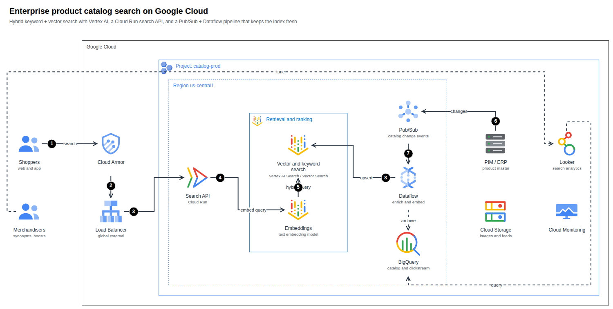

# Images, SVG and draw.io

| Format | How | Notes |
|---|---|---|
| **HTML page** | `render`, `finalize` | Standalone: no external requests. Diagram, Cost and Well-Architected tabs. |
| **SVG** | `render --svg`, `finalize`, or Export ▾ in the page | The page export is a **dual-theme SVG** (light, switching to dark when the viewer prefers it). Viewer state (focus, dimming, route, passport) is stripped. |
| **PNG** | `render --png`, `finalize`, or Export ▾ (also JPEG, WebP, copy to clipboard) | Needs Chrome/Chromium. |
| **draw.io** | `export`, `render --drawio`, `finalize`, or Export ▾ → *Download draw.io (.drawio)* | Uses draw.io's own Google Cloud icons. See below. |
| **JSON receipt** | `finalize` | Hashes and check results; see [Quality gates](finalize.md). |

<a id="drawio"></a>

## draw.io

```bash
archify-gcp export spec.json -o diagram.drawio
archify-gcp render spec.json --drawio
```

The file opens in [draw.io / diagrams.net](https://app.diagrams.net) (desktop, web, or the VS Code extension) and is fully editable.



What maps to what:

| archify-gcp | draw.io |
|---|---|
| Product and general icons | The official SVG embedded as an image cell (`image;aspect=fixed;…image=data:image/svg+xml,…`) — the same mechanism draw.io's own Google Cloud (`gcp2`) library uses |
| Google Cloud, organization, folder, project, region, zone, VPC, subnet, perimeter… | Styled **container** cells with the group's colour and dash and the official group icon in the corner |
| Nested groups | Real **containers**: move a group and its children follow |
| Edges | Attached to their icons, with the original waypoints and exit/entry points, open arrowheads, dashed style |
| Numbered callouts | Black numbered circles; the step description is the tooltip |
| Sequence diagram | Icons, dashed lifelines, message edges, `alt`/`loop`/`par` frames and notes |

!!! note "Notes on fidelity"
    * Layout is the archify-gcp layout. draw.io may re-route an edge a little when you drag things.
    * An icon without a draw.io equivalent is embedded as the official SVG instead of failing; `export` tells you how many.
    * Edge labels are real edge labels (they follow the edge); callout circles are separate shapes.
    * The export is validated before it is written (unique ids, every reference resolves, every embedded icon is a valid SVG).

## Presentation and documents

* Use `--theme dark` for slides and keep `light` for documents. Training and certification diagrams should use light.
* For a portrait page (Word, blogs) prefer `column` layouts at the root.
* PNG size follows the diagram; scale it in your document rather than re-flowing the spec.

## Icon licensing

Icons are © Google LLC. Use them to depict Google Cloud architecture, do not alter them, and do not imply Google endorsement. Rendered pages embed the icons they use; check the current Google terms for the icons before publishing diagrams widely.
