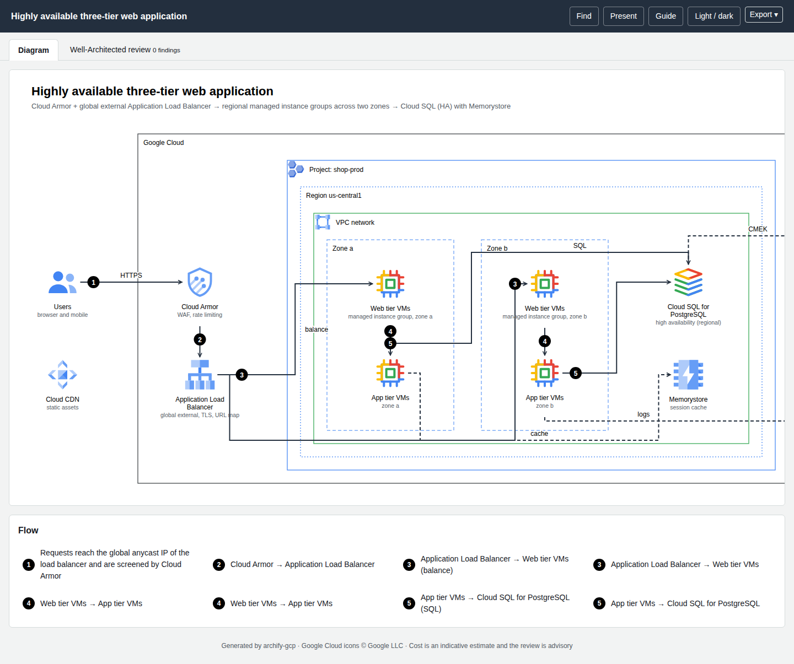

# Getting started

## Requirements

* **Node.js ≥ 20** (22 is what the project is developed on). There are **no npm dependencies**.
* **Chrome or Chromium** for PNG export and the browser check in `finalize`. Set `CHROME_PATH` if it is not found automatically. Without it, HTML, SVG, draw.io and receipts still work.
* Network access once, to download the official icons (and optionally to refresh pricing and Well-Architected data).

## Install

```bash
git clone https://github.com/akashtalole/archify-gcp
cd archify-gcp
npm run icons:fetch          # official Google Cloud icon package → assets/gcp-icons/ (git-ignored)
node bin/archify-gcp.mjs doctor
```

`doctor` prints the Node version, whether icons were found, and the catalog size (223 products, 10 general icons, 6 group icons).

!!! tip "Use it as a command"
    `npm link` (or `npx`) exposes `archify-gcp`; the rest of this guide writes `archify-gcp …` for `node bin/archify-gcp.mjs …`.

## Your first diagram

Start from a template:

```bash
archify-gcp init three-tier -o my-app.json     # or serverless-api, genai-rag
archify-gcp finalize my-app.json -o out/my-app.html
```

`finalize` validates the spec, renders it, runs strict checks, opens the page in headless Chrome to verify it, exports a PNG and writes a receipt. Outputs go next to `-o` (or to `meta.output` in the spec; the templates point at `examples/out/`, so pass `-o` for your own work):

```text
✔ validate       pass
✔ analyze        pass
✔ render         pass
✔ check          pass
✔ browser-check  pass
✔ export-png     pass

architecture: 11 nodes · 9 edges
html   out/my-app.html
svg    out/my-app.svg
drawio out/my-app.drawio
png    out/my-app.png
receipt out/my-app.receipt.json
Cost: $1,074.61/month (indicative)
Well-Architected (advisory): 0 critical · 0 high · 0 medium · 1 low; 21/307 best practices evidenced
```

Open `my-app.html`. The tabs are **Diagram**, **Cost** and **Well-Architected review**. Add `?tab=cost` or `?tab=wa` to the URL to deep-link to a tab.



!!! warning "Look at the picture"
    `finalize` proves the mechanics (valid spec, routable edges, no overlaps it can detect, page loads without errors). It records `"visualReview": "not-performed"` on purpose. Open the PNG and check labels, tangles and clarity before you share it.

## Pick the right diagram type

```bash
archify-gcp guide "GKE service behind a global load balancer with Cloud SQL, plus the login flow"
```

`guide` suggests a diagram type (architecture, sequence or dataflow) and a template, plus companion diagrams worth drawing. See [Writing a spec](spec-architecture.md).

## Edit and re-run

A spec is plain JSON. Edit it, run `archify-gcp render my-app.json --strict` for the quick loop (warnings become exit code 2), and `finalize` when you are done. Editors get completion and validation from the JSON Schemas:

```bash
archify-gcp schema architecture      # prints the path to schemas/architecture.schema.json
```

Add `"$schema": "…/schemas/architecture.schema.json"` to your spec to use it in VS Code.

## Next steps

* [Describe your own architecture](spec-architecture.md)
* [Add real usage numbers so the cost estimate means something](cost.md)
* [Read the Well-Architected tab](well-architected.md)
* [Open it in draw.io](exporting.md#drawio)
