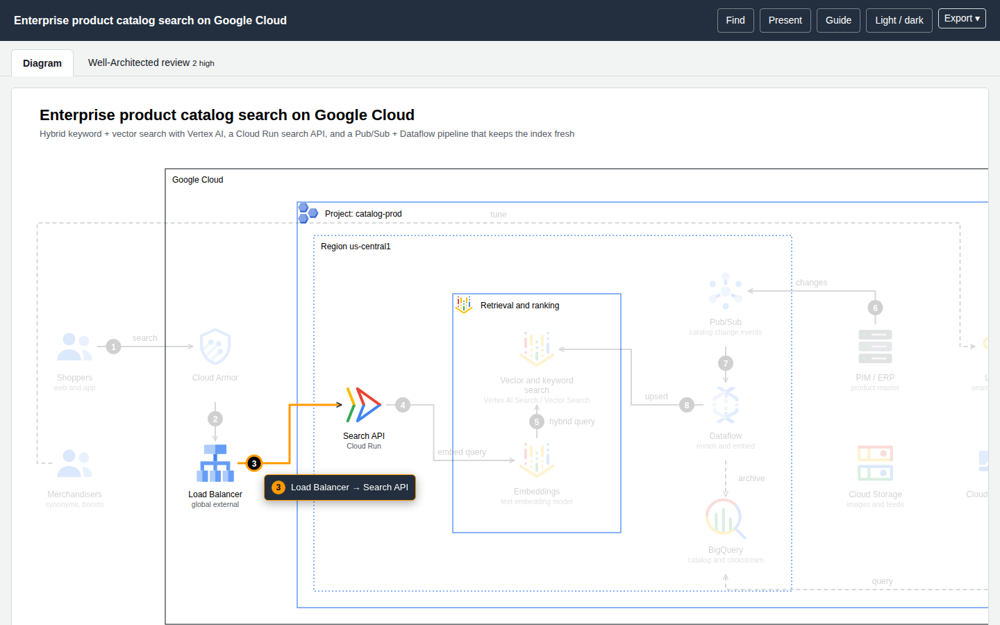
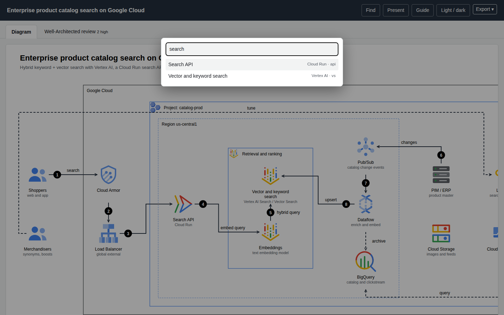

# Viewer and numbered callouts

Every generated page embeds the same reader. It needs no network and no libraries, and it works only on the **authored relationships** (your edges and messages) — never on geometry. Results are therefore "authored reachability", not runtime causality or blast radius.



| Feature | How to use it |
|---|---|
| **Numbered callouts** | Hover a number on the diagram. A popup shows the same description as the **Flow** list below (the edge `desc`, otherwise "From → To (label)"), the connection is highlighted and the matching Flow row lights up. |
| **Focus and Passport** | Click a node: its upstream and downstream relationships (with step numbers and labels), service, category and id. |
| **Reach** | In the Passport choose Reach ↓ / ↑ / Both, or use the link `#focus=<id>&reach=downstream\|upstream\|both`. Everything not reachable dims. |
| **Route probe** | Passport → *Route to…*, or `#route=<from>~<to>`. Shows the shortest **directed** path, or says "no directed route". |
| **Finder** | `/` or Ctrl/⌘+K searches label, service name or id and jumps to the node. |
| **Presentation** | `p` or `?present=1` hides the page chrome and fills the viewport; Esc leaves. |
| **Theme** | `t`, the header button, or `?theme=dark`. |
| **Guide** | `?` lists every action and shortcut. |
| **Tabs** | **Diagram**, **Cost**, **Well-Architected review**; deep-link with `?tab=cost` or `?tab=wa`. |
| **Hover previews** | Hover a node, a Flow step or a review finding to preview its connections. |
| **Export** | Export ▾ → copy or download PNG, JPEG, WebP, a dual-theme SVG, or a `.drawio` file. See [Exporting](exporting.md). |



## Deep links

Links are plain URL fragments and query strings, so they can go in tickets and docs:

```text
diagram.html#focus=searchfn&reach=downstream
diagram.html#route=shoppers~os
diagram.html?tab=wa
diagram.html?theme=dark&present=1
```

## Cost overlay and cross-links

* On the **Cost** tab, *Show monthly cost on the diagram* puts a `$/mo` tag under every priced node. Clicking a row in the component table jumps to that node on the diagram.
* On the **Well-Architected** tab, hovering a finding highlights the components involved.

## What it does not do

Motion or trace animation, share cards, WebM recording and locale packs from Archify are not implemented.

## Machine check

`?check=1` makes the page emit a hidden `<pre id="archify-check">` with node and edge counts, horizontal overflow, the smallest rendered text size, unresolved icon references and a viewer self-test. `finalize` reads it through headless Chrome; readers never see it.
